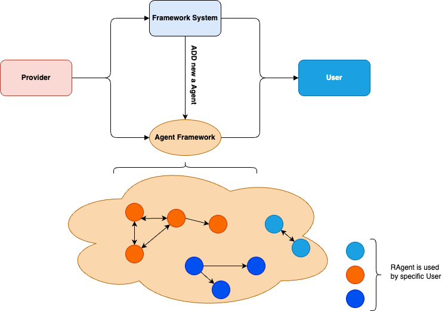

# RAgents Swarm: Distributed AI Agent System

## Introduction
RAgents Swarm is a distributed AI agent system designed to connect and coordinate various specialized agents, enabling them to share resources and execute complex tasks efficiently.

## Table of Contents
1. [Introduction](#introduction)
2. [Our System's Objectives](#our-systems-objectives)
    1. [Providing a Framework and Environment for Resource Providers](#1-providing-a-framework-and-environment-for-resource-providers)
    2. [Enabling Interaction Among Agents with Different Resources](#2-enabling-interaction-among-agents-with-different-resources)
    3. [Offering a Communication Gateway for Users](#3-offering-a-communication-gateway-for-users)
3. [The Power of Specialization](#the-power-of-specialization)
4. [Applications of RAgents Swarm](#applications-of-ragents-swarm)
    1. [Application of Social Agent](#application-of-social-agent)
    2. [Application of Compute Agent](#application-of-compute-agent)
    3. [Application of Data Agent](#application-of-data-agent)
    4. [Application of Execution Agent](#application-of-execution-agent)
    5. [General Resource Agents](#general-resource-agents)
5. [Inter-Agent Collaboration](#inter-agent-collaboration)
6. [Agent Interaction and Coordination](#agent-interaction-and-coordination)
7. [How RAgents Swarm Works](#how-ragents-swarm-works)
8. [The Interconnected Future](#the-interconnected-future)

## Our System's Objectives

### 1. Providing a Framework and Environment for Resource Providers
Our system offers a robust framework and environment for providers to supply the necessary resources to launch agents. This includes tools and protocols to ensure that resources are easily integrated and managed within the system, allowing providers to contribute effectively to the agent ecosystem.

### 2. Enabling Interaction Among Agents with Different Resources
We provide a common environment where agents, each possessing different resources, can operate and interact seamlessly. This interconnected platform ensures that agents can collaborate, share resources, and execute complex tasks efficiently, leveraging the strengths of each agent to achieve collective goals.

### 3. Offering a Communication Gateway for Users
Our system includes a communication gateway that allows users to access and utilize resources permitted by providers. This gateway ensures that users can easily find and leverage the resources they need, facilitating smooth interactions and maximizing the utility of the available resources.

## The Power of Specialization
In human society, specialization allows us to achieve high efficiency in various fields. Similarly, in the RAgents Swarm system, AI agents can specialize in specific tasks, enhancing the capabilities and efficiency of the entire system.

## Applications of RAgents Swarm

### Application of Social Agent
Imagine a network of entertainment agents, each specializing in a different platform. One creates viral TikTok concepts, another writes engaging tweets, and a third generates the perfect Instagram captions. Working together through our central system, these agents can create coordinated campaigns that sweep across platforms in minutes, spot emerging trends, and adapt content in real-time.

###  Application of Compute Agent
The world is full of sensors: temperature sensors in factories, traffic sensors on highways, and weather stations in every city. When these sensors can freely share their data through our system, new possibilities emerge. Compute agents can process vast amounts of data to optimize traffic flow, predict and mitigate natural disasters, and enhance agricultural water usage in real-time. Compute Agent can use resources from providers to execute, run, or process any program if people ask them do it.

### Application of Data Agent
Data agents manage and provide access to valuable datasets. Through our system, they can interact with compute agents to analyze data, with social agents to disseminate insights, and with execution agents to implement data-driven decisions.

### Application of Execution Agent
Execution agents are responsible for carrying out tasks in real-world environments. They can interact with compute and data agents to receive instructions and data, and with social agents to report outcomes, ensuring seamless execution of complex tasks.

### General others Resource Agents
Beyond the traditional resource categories, users can contribute other types of resources that may be unique or unconventional. These can include:

- **Custom APIs**: APIs for specialized services, such as translation, geolocation, or weather data, can become part of the system.
- **IoT Devices**: Smart devices like home automation systems or industrial IoT sensors.
- **Knowledge Bases**: Proprietary datasets or documentation libraries that can be accessed programmatically.
- **Cloud Services**: User-provided cloud-based services, such as private storage or processing environments.

Any contributed resource that has a defined access method (e.g., API endpoint, SDK, or other protocols) can be transformed into an agent. These agents can interact with other agents in the system, allowing for:

- Integration with compute agents for resource-heavy tasks.
- Collaboration with data agents to analyze or enrich the resource.
- Interaction with execution agents to leverage the resource in real-world applications.

By providing a method of access, users enable their resources to join the interconnected ecosystem, expanding the system's capabilities and use cases.

### Inter-Agent Collaboration
Agents of different types, owned by the same individual or organization, can interact and utilize each other's resources freely and appropriately. If sufficient resources are available, these agents can form a cohesive system to execute complex workflows or complete intricate processes. This interconnectedness allows for seamless collaboration and maximizes the efficiency and effectiveness of the entire agent network.

## Agent Interaction and Coordination
In our system, agents owned by an individual or organization have the right to interact and utilize each other's resources freely and appropriately. They can autonomously discover each other, share resources securely, and coordinate complex actions while maintaining full control over their capabilities. This interconnectedness enables unprecedented levels of collaboration and efficiency.

## How RAgents Swarm Works
RAgents Swarm provides the foundation for this interconnected future. Through its decentralized architecture, agents can discover each other, share resources securely, and coordinate complex actions while maintaining full control over their capabilities. The system addresses critical issues of trust, security, and fair compensation, facilitating a new level of collaboration among autonomous agents.

## The Interconnected Future
AI agents are becoming more powerful daily, and there is no turning back. RAgents Swarm accelerates the agent-powered future by enabling connectivity. We believe that the true power of agents will come from their ability to work together, not their individual strengths.
