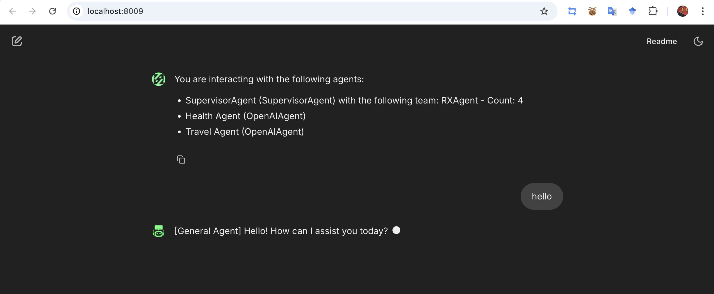

# About rAgent

rAgent is a specialized Resource Agent framework that leverages Large Language Models (LLMs) to intelligently control and interact with various resources. This repository provides the implementation and tools needed to build powerful agents that can understand context and perform actions on external systems.

## Key Features

- Integration with multiple LLM providers
- Extensible agent architecture
- Built-in resource connectors
- Simple API for creating custom agents
- Web and console interfaces

# Example & Quick Start 
This section provides step-by-step instructions to quickly run rAgent. Whether in a simple console-based interaction or a web-based UI using Chainlit, these examples will help you deploy and test your agent effortlessly.

## Installation
Before running **rAgent**, it’s highly recommended to set up a virtual environment to isolate dependencies.

### Method 1: Using python-env

**Step 1: Create and Activate a Virtual Environment**
Run the following commands in your terminal
```console
# Create a virtual environment
python -m venv venv

# Activate the virtual environment (MacOS/Linux)
source venv/bin/activate
# Activate the virtual environment (Windows)
venv\Scripts\activate
```
**Step 2: Clone the repository**
```Console
git clone https://github.com/Rivalz-ai/Ragent-python.git

cd Ragent-python
```
**Step 3: Install Dependencies**

Direct to folder cookbook, then install requirement
```console
pip install -r requirement.txt
```
Now you’re ready to run the agent!

### Method 2: Using conda
**Step 1: Create conda environment**
Run the following commands in your terminal

```console
conda create -n ragent python=3.11

conda activate ragent
```
**Step 2: Clone the repository**
```Console
git clone https://github.com/Rivalz-ai/Ragent-python.git

cd Ragent-python
```
**Step 3: Install Dependencies**

Direct to folder cookbook, then install requirement
```console
pip install -r requirement.txt
```
Now you’re ready to run the agent!

### Method 3: Using uv (Recommended)
**Step 1: Install uv (A fast Python package installer and resolver)**
```console
curl -LsSf https://astral.sh/uv/install.sh | sh
```
**Step 2: Clone the repository**
```Console
git clone https://github.com/Rivalz-ai/Ragent-python.git

cd Ragent-python
```
**Step 3: Create a new virtual environment and activate it**
```console
uv venv
source .venv/bin/activate  # On Unix/macOS
# Or on Windows:
# .venv\Scripts\activate
```
**Step 4: Install dependencies**
```console
uv pip install -r requirements.txt
```
## Configuration
**1. Create your .env file (you can copy from the example)**
```console
cp .env-example .env
```
**2. Edit .env file to add your API keys and customize settings**

**2.1 You can only setup openAI key**
```console
OPENAI_API_KEY="your-api-key"
```

**2.2 If you using another LLM model. If you use other models based on Openai api, please only setup these things**

```console
# For other API KEYS
custom_base_url="url-custom"
deep_infra_api_key="api-key"
deep_infra_model="model-name"
```

## Run code
### Method 1: Very Quick to access our Rivalz RX Agent
Come to our ROME then create a project! you will have a auth-key. Then push it into the .env file : 
```console
auth_key = "your-auth-key"
````
One line for run Rivalz RX :
```console
chainlit run rivalz_multiRX.py
```

### Method 2: Run your custom RX:
First step, open the **x_token.yml** then add your key to the file!
```yml
# X (Twitter) Account Credentials
accounts:
  - name: "Account 1"
    client_id: ""
    client_secret: ""
    refresh_token: ""
    access_token: ""
    
  - name: "Account 2"
    client_id: ""
    client_secret: ""
    refresh_token: ""
    access_token: ""    
  - name: "Account 3"
    client_id: ""
    client_secret: ""
    refresh_token: ""
    access_token: ""
# You can add more accounts as needed by following the same structure
# Instructions:
# 1. Replace the empty strings with actual credentials
# 2. Each account must have all three fields filled
# 3. Add or remove account blocks as necessary
```
Second, Run the file:
```python
chainlit run main.py
```

### Method 3: Modify Sample by create your rX Agent (1 rx)

#### Run RX agent with chainlit example
Create a Python script (run_chainlit.py) with the following code:
```python
import uuid
import chainlit as cl
import os
from dotenv import load_dotenv

# Import RXAgent
from rAgent.ragents import RXAgent, RXAgentOptions
from rAgent.types import ConversationMessage
from rAgent.agents import AgentCallbacks
import asyncio
class ChainlitAgentCallbacks(AgentCallbacks):
    def on_llm_new_token(self, token: str) -> None:
        asyncio.run(cl.user_session.get("current_msg").stream_token(token))

# Load environment variables
load_dotenv()
OPENAI_API_KEY = os.getenv("OPENAI_API_KEY")
OPENAI_MODEL = os.getenv('OPENAI_MODEL')
DEEP_INFRA_KEY = os.getenv("deep_infra_api_key")
DEEP_INFRA_URL = os.getenv("base_url")
DEEP_INFRA_MODEL= os.getenv("deep_infra_model")
# Create RXAgent
def create_X_agent(access_token, refresh_token, client_secret, client_id):
    if access_token != "" and access_token is not None:
        return RXAgent(RXAgentOptions(
                            name=f"RX_Agent",
                            description=(
                                f"Social media (Twitter/X) posting agent ##"
                                " - can post tweets and handle replies."
                                "- If user asks the normal question, please answer it normaly."
                            ),
                            api_key=OPENAI_API_KEY,  # Use same OpenAI key as lead agent
                            model=OPENAI_MODEL,  # Use same OpenAI model as lead agent
                            # base_url=self.lead_agent.base_url,  # Use same OpenAI base URL as lead agent
                            xaccesstoken=access_token,
                            xrefreshtoken=refresh_token, ## optional
                            client_secret=client_secret,## optional
                            client_id=client_id,## optional
                            inference_config={
                                'maxTokens': 500,
                                'temperature': 0.5,
                                'topP': 0.8,
                                'stopSequences': []
                            },
                            callbacks=ChainlitAgentCallbacks(),
                        ))
    else:
        raise ValueError("Access token is required to create X agent")

agent = create_X_agent(access_token="your-x-access-token", refresh_token="", client_secret="", client_id="")

@cl.on_chat_start
async def start():
    cl.user_session.set("user_id", str(uuid.uuid4()))
    cl.user_session.set("session_id", str(uuid.uuid4()))

@cl.on_message
async def handle_message(message: cl.Message):
    user_id = cl.user_session.get("user_id")
    session_id = cl.user_session.get("session_id")

    msg = cl.Message(content="")
    await msg.send()
    cl.user_session.set("current_msg", msg)

    response = await agent.process_request(
        input_text=message.content,
        user_id=user_id,
        session_id=session_id,
        chat_history=[]
    )

    if isinstance(response, ConversationMessage):
        await msg.stream_token(response.content[0]["text"])

    await msg.update()

# Run Chainlit server
if __name__ == "__main__":
    cl.run()
```
***Run the Chainlit Server***
```console

chainlit run run_chainlit.py
```
A web interface will open, allowing you to chat with RXAgent in real-time.


A DEMO:
<div>
<div align="center">
<a href="#" target="_blank">
  
</a>
</div> 
