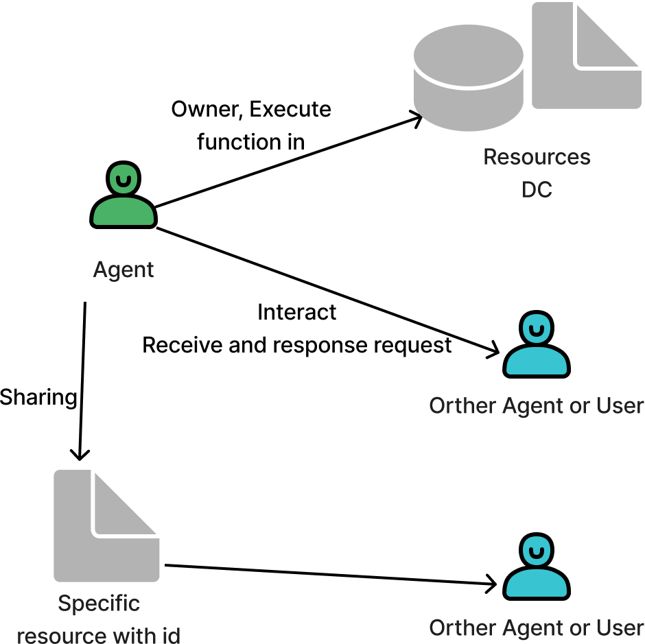
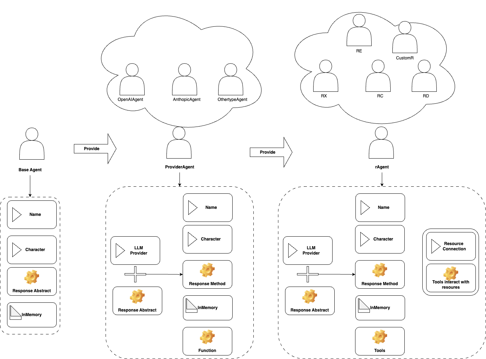
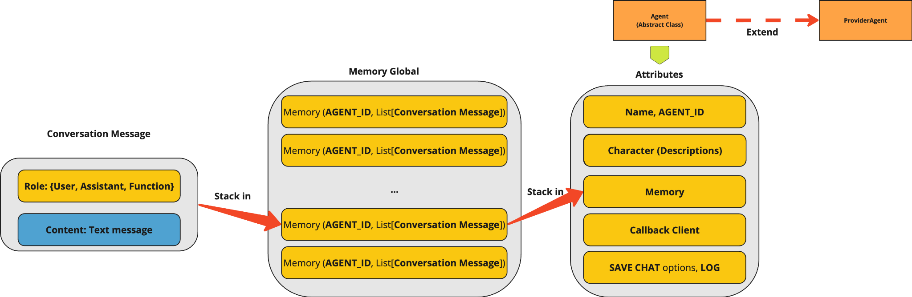

<!-- 
<div>
<div align="center">
<a href="#" target="_blank">
  
</a>
</div>  -->

<div>
<div align="center">
<a href="#" target="_blank">
  
</a>
</div> 
<h1 align="center" style="font-size: 3em;">🌍 rAgent Framework&nbsp;</h1>


<p align="center">The <strong> RAgent Framework </strong> is a specialized AI agent development platform that makes it easy to own, interact with, and share <strong> intelligent resources </strong>.</p>


<p align="center">
  <a href="https://github.com/Rivalz-ai/Ragent-python/tree/dev"></a>
  <!-- <a href="https://pypi.org/project/multi-agent-orchestrator/"></a> -->
  <a href="https://github.com/Rivalz-ai/RAgents-Documents/"></a>
</p>

<p align="center">
  <!-- GitHub Stats -->
  
  
  
</p>

<p align="center">
  <!-- Repository Info -->
  
  
  
</p>

<!-- <p align="center">
  <!-- Package Stats -->
  <!-- <a href="https://pypi.org/project/multi-agent-orchestrator/"></a> -->
 <!--  </p> -->
----
## 📌 Overview of rAgent

### 🧠 What is rAgent?
RAgent (**Resource-Based Agent**) is an intelligent, decentralized agent designed to **manage, allocate, and share computational resources** within a multi-agent ecosystem. It transforms various digital assets—such as social media accounts, computing power, data, and execution environments—into functional agents.
<div align="center">
  
</div>


### 🎯 Why was RAgent created?
RAgent was developed to:
- ⚡ **Automate resource allocation** – Efficiently distribute and utilize resources without manual intervention.
- 🔄 **Facilitate resource coordination** – Enable AI agents and systems to share, lend, or exchange computing resources seamlessly.
- 🚀 **Optimize computational performance** – Prevent underutilization and maximize efficiency.
- 🏗 **Handle high-demand computational jobs** – Empower AI agents to tackle complex workloads beyond a single agent’s capability.

### 🌐 How does RAgent operate in a decentralized Swarm system?
RAgent seamlessly integrates into Swarm-based AI ecosystems, enabling:
- 🔁 **Intelligent resource sharing** – Dynamic allocation of CPU, memory, bandwidth, and storage.
- 🤖 **Collaborative job execution** – Workload distribution across multiple agents.
- 📊 **Dynamic resource management** – Agents can request additional resources from peers.
- ⚖ **Optimized load balancing** – Advanced algorithms ensure even resource distribution.

---

## ✨ Key Features
- 🏗 **Pre-Built Base Agent** – A standardized yet adaptable agent framework.
- 🛠 **Built-In rAgents** – Ready-to-use Resource Agents for seamless Swarm integration.
- 🔧 **Custom rAgent Flexibility** – Modify or create AI Agents tailored to specific needs.
- 🧠 **Conversation Memory Storage** – Enables context-aware interactions.
- 🔄 **Flexible Agent Responses** – Supports both **Streaming** and **Non-Streaming** responses.

---

## 🔑 Types of rAgent
RAgent comes in two distinct types, offering different levels of customization:

### 🏗 Built-In rAgents
**Pre-configured AI agents** designed for specific computational jobs, ensuring **plug-and-play** integration.

#### 📌 Available rAgents
- **🕊 RX (Social Agent)** – Connects to Twitter (X) for decentralized social interactions.
- **💻 RC (Compute Agent)** – Executes edge computing jobs.
- **📊 RD (Data Agent)** – Manages and stores data.
- **⚙️ RE (Execution Agent)** – Runs nodes, applications, and other software autonomously.

### 🔨 Custom rAgents
Custom rAgents allow users to extend the framework by integrating their **own resources, computation models, and execution logic**. Our framework provides:

- **📦 Pre-packaged Components** – We've carefully encapsulated core functionalities into reusable modules
- **🧩 Extensive Base Classes** – Well-defined abstract classes handle common agent behaviors and interactions
- **⚡ Simplified Development** – Create new agents with minimal code by extending our base classes
- **🔌 Plug-and-Play Integration** – Custom agents seamlessly connect with built-in framework services
- **🛠️ Flexible Architecture** – Modify only the components you need while inheriting standard functionality

This modular approach dramatically reduces development time, allowing you to focus on your agent's unique capabilities rather than rebuilding core infrastructure. Whether you're integrating proprietary resources or implementing specialized computation logic, the rAgent framework provides the foundation for rapid agent development.

---

## 🏛 Structure of rAgent

The rAgent Framework follows a hierarchical structure that provides modular and extensible components for building and managing AI-powered resource agents. It is designed to facilitate interaction, resource management, and intelligent decision-making within Swarm networks. By adopting a modular design, rAgent enables seamless integration into multi-agent systems while allowing high levels of customization.

This architecture has been meticulously designed with a hierarchical tree structure to support both built-in and custom Agent creation. Our components enable derived classes to inherit functionality from base classes, making agent development flexible yet standardized.

### 🏗 Hierarchical Structure

The rAgent framework is built upon an inheritance model that ensures modularity and extensibility:

- **🔄 BaseAgent** – Defines the fundamental attributes and behaviors of an agent, serving as the core class for all agent types.

- **🧠 ProviderAgent** – Inherits from BaseAgent and integrates Large Language Models (LLMs) to enable agents to process language-based logic, making them capable of natural language understanding and reasoning.

- **🛠️ rAgent** – Inherits from ProviderAgent and expands functionalities by adding resource management, tool execution, and integration with external APIs, allowing interaction with specialized data sources or computational services.
<div align="center">
  
</div>


#### Class Inheritance Overview:
```diagram
Agent (Base class)
↓
ProviderAgent (Abstract class for LLM providers)
↓
├── OpenAIAgent
├── AnthropicAgent
├── ... More Provider Agent
  ↓
  ├── rAgent (ProviderAgent)
    ↓
    └── RX Agent 
    └── RD Agent
    └── RE Agent
    └── RC Agent
    └── Custom rAgent
```
#### Characteristic of the structure
  - **Modularity and Scalability**:
    - The framework is designed to be modular, ensuring each agent can be extended or modified without affecting others.
    - Scalability allows multiple agents to interact and operate concurrently within a system.
  - **Extensibility**:
    - Developers can create new agents that inherit from rAgent and expand their functionality.
    - Supports resource management for efficient interaction with databases, APIs, and other systems.


The rAgent framework follows an inheritance model where each agent type builds upon the capabilities of its parent. Below, we detail the specific attributes, methods, and functionality each agent type inherits and extends:

### 🔄 BaseAgent Class

BaseAgent provides core functionalities and attributes common to all agents.

**Core Attributes**  
- `name`: Unique identifier for the agent.  
- `description`: Brief overview of the agent's purpose.  
- `save_chat`: Enables or disables memory storage.  
- `callbacks`: Handles event-driven interactions realtime during execution.  
- `share_global_memory`: Determines if the agent can access global memory across agent instances in collaborative mode.  
- `character`: Defines the agent’s persona and behavioral style.  
- `in_memory`: Stores temporary data for session-based interactions.

**Key Methods:**
- `initialize()`: Sets up the agent environment

- `process_request(input_text, user_id, session_id, chat_history, additional_params)`: Abstract method that must be implemented by subclasses. It processes user input, maintains contextual history, and generates a response via the appropriate logic or model interaction.
<!-- - `execute_action()`: Performs the agent's primary functions
- `update_state()`: Manages the agent's internal state -->

```python
from abc import ABC, abstractmethod
from typing import List, Dict, Any, Union, AsyncIterable

class BaseAgent(ABC):
  def __init__(self, options: AgentOptions):
    self.name = options.name
    self.description = options.description
    self.save_chat = options.save_chat
    self.callbacks = options.callbacks or AgentCallbacks()
    self.share_global_memory = options.share_global_memory or False

  @abstractmethod
  async def process_request(
    self,
    input_text: str,
    user_id: str,
    session_id: str,
    chat_history: List[ConversationMessage],
    additional_params: Dict[str, Any] = None
  ) -> Union[ConversationMessage, AsyncIterable[Any]]:
    ...
  @abstractmethod
  async def initialize():
    ...
```
---
### 🧠 ProviderAgent (extends BaseAgent)
**ProviderAgent** extends **BaseAgent** by integrating LLMs for advanced language processing. This enables the agent to generate responses, perform complex reasoning, and utilize external knowledge sources by adding it into tools.

**Inherited from BaseAgent:**
- All core attributes and methods
- Basic request handling capabilities

**Added Attribute:**
- `llm_provider`: Connection to specific language model services
- `extra_tools`: List of additional tools that extend the agent’s functionality beyond LLM interaction.
- `llm_params`: Custom parameters for connecting and configuring LLMs, making it adaptable to different models.
- `inference_config`: Fine-tunes response generation settings such as temperature, max tokens, and top-p filtering.
- `streaming`: Enables streaming responses, allowing the agent to return partial results in real-time. If enable streaming, we also need `callbacks`.


**Key Methods:**
- `initialize_client()`: Initializes the LLM client based on provided parameters and authentication credentials.
- `handle_single_response(request_options)`:
Manages synchronous responses from external LLMs, ensuring deterministic output.
-  `handle_streaming_response(request_options)`:
Enables efficient handling of real-time, incremental outputs from streaming LLM responses.
-  `_configure_tools(extra_tools)`:Registers and configures tools available to the agent
- Others `interaction_method()`: Enable Agent can interact with internet, resources,...

The bellow codes is the definition of ProviderAgent Class:
```python
class ProviderAgent(BaseAgent, ABC):
  def __init__(self, options: ProviderAgentOptions):
    super().__init__(options)
    self.streaming = options.streaming or False
    self.inference_config = options.inference_config or {}
    self.extra_tools = options.extra_tools or []
    self.llm_params = options.llm_params or {}
    self.client = self.initialize_client()
    self._configure_tools()

  def initialize_client(self):
    if self.llm_params.get("provider") == "openai":
      return OpenAI(**self.llm_params)
    elif self.llm_params.get("provider") == "anthropic":
      return AnthropicClient(**self.llm_params)
    else:
      raise ValueError("Unsupported LLM provider")

  def is_streaming_enabled(self) -> bool:
    return self.streaming

  @abstractmethod
  async def handle_single_response(self, request_options: Dict[str, Any]) -> Any:
    pass

  @abstractmethod
  async def handle_streaming_response(self, request_options: Dict[str, Any]) -> Any:
    pass

  async def initialize(self):
    pass
  
  def _configure_tools(self):
    """
    Setup system tool for Agent;
    """
    # Inital system tools
    system_tool =  AgentTools(tools=[tool1, tool2,...])
    # Adding
    for tool in self.extra_tools:
      # adding system_tool
      self.extra_tools.extend(system_tools)
      pass

  @abstractmethod
  async def process_request(
    self,
    input_text: str,
    user_id: str,
    session_id: str,
    chat_history: List[ConversationMessage],
    additional_params: Dict[str, Any] = None
  ) -> Union[ConversationMessage, AsyncIterable[Any]]:
    """
    In this method, the request logic is processed, function calls are performed, and the result is returned for each Provider type.
    """
    pass
```


For the details setup of some built-in providers, please refer to:
- [OpenAIAgent](r-Agent-system.MD)
- [AnthropicAgent](r-Agent-system.MD)
- [BedrockAgent](r-Agent-system.MD)
- [LexBotAgent](r-Agent-system.MD)


### 🛠️ rAgent (extends ProviderAgent)
**rAgent** is a specialized class designed to manage and interact with external resources, such as databases, APIs, or computational services. This enhances the agent’s ability to operate autonomously while leveraging external data sources.

**Inherited from ProviderAgent:**
- Language model integration
- Response generation
- Tools handler intergration
**Added Functionality:**
- `resource_id`: Unique identifier for the resource.
- `resource_type`: Specifies the type of resource (e.g., database, compute node, social media).
- `resource_auth`: Credentials or authentication details for accessing protected resources.
- `resource_config`: Configuration settings specific to the resource.
- `resource_tools`: Tools designed specifically for direct interaction with the resource.
- `extra_tools`: Additional external tools that can be used in conjunction with the resource tools.

**Key Methods:**
- `connect_resource()`: Establishes secure, persistent connections to external resources such as databases, APIs, or cloud services.
- `validate_resource_access()`: Ensures that authentication credentials are valid and sufficient for accessing the designated resources.
- `refresh_authentication()`:Periodically refreshes authentication tokens or credentials to maintain uninterrupted access to protected resources.
- `_configure_tools(tools)`: Registers and configures resource tools and extra tools .

The below codes is the prototype of rAgent:
```python
class rAgent(ProviderAgent):
    def __init__(self, options: rAgentOptions):
        super().__init__(options)
        self.resource_id = options.resource_id
        self.resource_type = options.resource_type
        self.resource_auth = options.resource_auth or {}
        self.resource_config = options.resource_config or {}
        self.resource_tools = AgentTools(tools=[])
        self._configure_tools(options.extra_tools)

    async def connect_resource(self) -> bool:
        """Establishes a secure connection with the external resource."""
        return True

    async def validate_resource_access(self) -> bool:
        """ Ensures that authentication credentials are valid and sufficient for accessing the designated resources."""
        return True   
    async def refresh_authentication(self) -> bool:
        """ refresh resource authen."""
        return True   
        
    def _configure_tools(self, extra_tools: Optional[Union[AgentTools, list[AgentTool]]]):
        interact_func = AgentTool(
            name="interact_with_resource",
            description="Executes predefined operations with the external resource.",
            properties={"param": {"type": "string", "description": "Operation-specific parameters."}},
            func=self.resource_interaction_function
        )
        self.resource_tools.tools.append(interact_func)
        if extra_tools:
            self.resource_tools.tools.extend(extra_tools)

    async def handle_single_response(self, request_options: Dict[str, Any]) -> Any:
      """Processes a single response from the LLM."""
      pass

    async def handle_streaming_response(self, request_options: Dict[str, Any]) -> Any:
      """Handles streaming responses in real-time."""
      pass

    async def process_request(
      self,
      input_text: str,
      user_id: str,
      session_id: str,
      chat_history: List[ConversationMessage],
      additional_params: Dict[str, Any] = None
    ) -> Union[ConversationMessage, AsyncIterable[Any]]:
      """Coordinates the request flow and returns final output."""
      pass
```


#### 📌Ragents built by Rivalz

**RX Agent (Social Agent):**
- Social media API integrations
- Content management tools
- Engagement tracking metrics

**RC Agent (Compute Agent):**
- Distributed computing interfaces
- Job scheduling algorithms
- Performance monitoring systems

**RD Agent (Data Agent):**
- Database connectors
- Data transformation utilities
- Storage optimization tools

**RE Agent (Execution Agent):**
- Runtime environments
- Code execution sandboxes
- Deployment automation utilities

For detail structure and implement of built-in rAgent, please refer to:
- [RX Agent](./rAgent-system.MD)
- [RC Agent](./rAgent-system.MD)
- [RD Agent](./rAgent-system.MD)
- [RE Agent](./rAgent-system.MD)

### ⚒️ Build A Custom rAgent
Developers can extend the framework by implementing custom rAgents tailored to their specific needs.

#### 🚀 How to build your own Agent, step by step
1. 🏗️ **Inherit** from rAgent to define a new resource agent.  
2. 🌐 **Specify** unique attributes related to the custom resource.  
3. 🔄 **Implement** necessary methods, such as connect_resource and process_request.  
4. 🏷️ **Register** the new agent within the Swarm ecosystem.

---

### 💾 Example: Creating a Custom Database Agent
```python
from typing import Dict, Any, List
from dataclasses import dataclass
from multi_agent_orchestrator.agents import rAgent, rAgentOptions
from multi_agent_orchestrator.types import ConversationMessage
from multi_agent_orchestrator.tools import AgentTool

@dataclass
class DatabaseAgentOptions(rAgentOptions):
  database_url: str
  credentials: Dict[str, Any]

class DatabaseAgent(rAgent):
    def __init__(self, options: DatabaseAgentOptions):
      super().__init__(options)
      self.database_url = options.database_url
      self.credentials = options.credentials
      self.config_system_prompt()

      query_tool = AgentTool(
        name="run_database_query",
        description="Executes a query on the connected database.",
        properties={
          "query": {
            "type": "string",
            "description": "SQL query string"
          }
        },
        func=self.query_database
      )
      self.resource_tools.tools.append(query_tool)
      self.tools = self.resource_tools.tools

    def config_system_prompt(self):
      """Adjusts the agent's default system prompt or character."""
      self.character = f"{self.character}\nEnsure proper database querying when required."

    async def connect_resource(self) -> bool:
      """Establish a connection to the database."""
      print(f"Connecting to database at {self.database_url}")
      return True

    async def validate_resource_access(self) -> bool:
      """Ensures that authentication credentials are valid and sufficient for accessing the designated resources."""
      return True

    async def refresh_authentication(self) -> bool:
      """refresh resource authen after a period."""
      return True

    async def query_database(self, query: str) -> List[Dict[str, Any]]:
      """Executes a database query and returns results."""
      print(f"Executing query: {query}")
      return [{"result": "Sample Data"}]

    async def process_request(
      self, input_text: str, user_id: str, session_id: str,
      chat_history: List[ConversationMessage], additional_params: Dict[str, Any] = None
    ) -> ConversationMessage:
      """Process user requests by executing database queries."""
    ...
```

### 🔑 Using a Custom Agent
Once the custom agent is implemented, it needs to be registered in the system to be recognized within the Swarm framework, or a standardlone Agent in systems:

```python
# Example registration of DatabaseAgent
db_agent_options = DatabaseAgentOptions(
  database_url="https://mydatabase.com",
  credentials={"user": "admin", "password": "securepass"},
  ... # other setting
)
db_agent = DatabaseAgent(db_agent_options)
...
# code for you to call db_agent answer 
```

By following these examples, developers can quickly extend the rAgent framework to create their own agents that interact with different resources, making the framework highly adaptable for diverse AI-driven applications.
## 🧠 Conversation Memory Storage

Effective memory management is crucial for the rAgent Framework, as agents must maintain context-aware interactions across multiple conversations. The framework employs a hybrid memory storage approach, combining global centralized memory with local agent-specific memory. This design ensures optimal scalability, seamless multi-agent collaboration, and efficient memory retrieval.

### 🔄 Hybrid Memory Architecture
The memory system in rAgent consists of two key components:
- **🌐 Global Centralized Memory** – (Centralized Storage):
  - Stores conversation histories across all agents in a structured manner.
  - Maintains consistency across different user sessions and Swarm AI networks.
  - Provides a shared knowledge base, enabling long-term contextual awareness.

- **🔒 Local Agent Memory** (In-Memory Storage) Agent-specific context and conversation history:
  - Each agent fetches relevant conversation history from Global Memory upon initialization.
  - Local agent memory caches recent interactions for fast real-time processing.
  - Updates occur both in-memory and globally, ensuring synchronization between agents.

<div align="center">
  
</div>

#### Hybrid Memory Advantages
This hybrid approach offers significant benefits:
- 🏃 **Local In-Memory Storage** – Quick response generation.
- 🌐 **Centralized Knowledge Base** – Maintains shared context across all agents.
- ⚡ **Fast Local Processing** – In-memory caching enables quick response generation across sessions.
- 🔄 **Seamless Synchronization** – Context retention across multiple sessions.
- 📈 **Horizontal Scalability** – Supports numerous agents operating in parallel.
- 🧠 **Distributed Intelligence** – Agents contribute to and draw from collective knowledge.
- 🏢 **Enterprise-Grade Architecture** – Leverages central indexing with distributed caching patterns.

## Example & Quick Start 
This section provides step-by-step instructions to quickly run rAgent. Whether in a simple console-based interaction or a web-based UI using Chainlit, these examples will help you deploy and test your agent effortlessly.

### Setting Up Your Environment
Before running **rAgent**, it’s highly recommended to set up a virtual environment to isolate dependencies.

**Step 1: Create and Activate a Virtual Environment**
Run the following commands in your terminal
```console
# Create a virtual environment
python -m venv venv

# Activate the virtual environment (MacOS/Linux)
source venv/bin/activate
# Activate the virtual environment (Windows)
venv\Scripts\activate
```
**Step 2: Install Dependencies**

Direct to folder cookbook, then install requirement
```console
pip install -r requirement.txt
```
Now you’re ready to run the agent!

### Run RX agent with chainlit example
Create a Python script (run_rx_chainlit.py) with the following code:
```python
import uuid
import chainlit as cl
import os
from dotenv import load_dotenv

# Import RXAgent
from r_agent.rx_agent import RXAgent, RXAgentOptions
from multi_agent_orchestrator.types import ConversationMessage

# Load environment variables
load_dotenv()

# Create RXAgent
def create_X_agent():
    options = RXAgentOptions(
        name="X Agent",
        description="Handles Twitter/X interactions such as posting tweets.",
        api_key=os.getenv("API_KEY"),
        model="gpt-4o",
        base_url="https://api.openai.com",
        xaccesstoken=os.getenv("TWITTER_ACCESS_TOKEN"),
        inference_config={
            "maxTokens": 500,
            "temperature": 0.5,
            "topP": 0.8,
            "stopSequences": []
        },
        tool_config={
            "tool": "Xtools",
            "toolMaxRecursions": 5
        }
    )
    return RXAgent(options)

agent = create_X_agent()

@cl.on_chat_start
async def start():
    cl.user_session.set("user_id", str(uuid.uuid4()))
    cl.user_session.set("session_id", str(uuid.uuid4()))

@cl.on_message
async def handle_message(message: cl.Message):
    user_id = cl.user_session.get("user_id")
    session_id = cl.user_session.get("session_id")

    msg = cl.Message(content="")
    await msg.send()
    cl.user_session.set("current_msg", msg)

    response = await agent.process_request(
        input_text=message.content,
        user_id=user_id,
        session_id=session_id,
        chat_history=[]
    )

    if isinstance(response, ConversationMessage):
        await msg.stream_token(response.content[0]["text"])

    await msg.update()

# Run Chainlit server
if __name__ == "__main__":
    cl.run()
```
***Run the Chainlit Server***
```console

chainlit run run_chainlit.py
```
A web interface will open, allowing you to chat with RXAgent in real-time.

## ⚠️ Disclaimer:
The rAgent Framework is currently under active development. Features, APIs, and documentation may change significantly as we continue to build and refine the system. We appreciate your patience and welcome feedbacks.  
