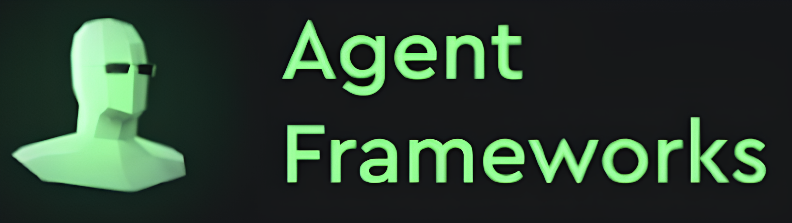

<!-- 
<div>
<div align="center">
<a href="#" target="_blank">
  
</a>
</div>  -->

<div>
<div align="center">
<a href="#" target="_blank">
  
</a>
</div> 
<h1 align="center" style="font-size: 3em;">🌍 rAgent Framework&nbsp;</h1>


<p align="center">The <strong> RAgent Framework </strong> is a specialized AI agent development platform that makes it easy to own, interact with, and share <strong> intelligent resources </strong>.</p>


<p align="center">
  <a href="https://github.com/Rivalz-ai/Ragent-python/tree/dev"></a>
  <!-- <a href="https://pypi.org/project/multi-agent-orchestrator/"></a> -->
  <a href="https://github.com/Rivalz-ai/RAgents-Documents/"></a>
</p>

<p align="center">
  <!-- GitHub Stats -->
  
  
  
</p>

<p align="center">
  <!-- Repository Info -->
  
  
  
</p>

<!-- <p align="center">
  <!-- Package Stats -->
  <!-- <a href="https://pypi.org/project/multi-agent-orchestrator/"></a> -->
 <!--  </p> -->
----
## 📌 Overview of rAgent

### 🧠 What is rAgent?
RAgent (**Resource-Based Agent**) is an intelligent, decentralized agent designed to **manage, allocate, and share computational resources** within a multi-agent ecosystem. It transforms various digital assets—such as social media accounts, computing power, data, and execution environments—into functional agents.
<div align="center">
  
</div>


### 🎯 Why was RAgent created?
RAgent was developed to:
- ⚡ **Automate resource allocation** – Efficiently distribute and utilize resources without manual intervention.
- 🔄 **Facilitate resource coordination** – Enable AI agents and systems to share, lend, or exchange computing resources seamlessly.
- 🚀 **Optimize computational performance** – Prevent underutilization and maximize efficiency.
- 🏗 **Handle high-demand computational tasks** – Empower AI agents to tackle complex workloads beyond a single agent’s capability.

### 🌐 How does RAgent operate in a decentralized Swarm system?
RAgent seamlessly integrates into Swarm-based AI ecosystems, enabling:
- 🔁 **Intelligent resource sharing** – Dynamic allocation of CPU, memory, bandwidth, and storage.
- 🤖 **Collaborative task execution** – Workload distribution across multiple agents.
- 📊 **Dynamic resource management** – Agents can request additional resources from peers.
- ⚖ **Optimized load balancing** – Advanced algorithms ensure even resource distribution.

---

## ✨ Key Features
- 🏗 **Pre-Built Base Agent** – A standardized yet adaptable agent framework.
- 🛠 **Built-In rAgents** – Ready-to-use Resource Agents for seamless Swarm integration.
- 🔧 **Custom rAgent Flexibility** – Modify or create AI Agents tailored to specific needs.
- 🧠 **Conversation Memory Storage** – Enables context-aware interactions.
- 🔄 **Flexible Agent Responses** – Supports both **Streaming** and **Non-Streaming** responses.

---

## 🔑 Types of rAgent
RAgent comes in two distinct types, offering different levels of customization:

### 🏗 Built-In rAgents
**Pre-configured AI agents** designed for specific computational tasks, ensuring **plug-and-play** integration.

#### 📌 Available rAgents
- **🕊 RX (Social Agent)** – Connects to Twitter (X) for decentralized social interactions.
- **💻 RC (Compute Agent)** – Executes edge computing tasks.
- **📊 RD (Data Agent)** – Manages and stores data.
- **⚙️ RE (Execution Agent)** – Runs nodes, applications, and other software autonomously.

### 🔨 Custom rAgents
Custom rAgents allow users to extend the framework by integrating their **own resources, computation models, and execution logic**. Our framework provides:

- **📦 Pre-packaged Components** – We've carefully encapsulated core functionalities into reusable modules
- **🧩 Extensive Base Classes** – Well-defined abstract classes handle common agent behaviors and interactions
- **⚡ Simplified Development** – Create new agents with minimal code by extending our base classes
- **🔌 Plug-and-Play Integration** – Custom agents seamlessly connect with built-in framework services
- **🛠️ Flexible Architecture** – Modify only the components you need while inheriting standard functionality

This modular approach dramatically reduces development time, allowing you to focus on your agent's unique capabilities rather than rebuilding core infrastructure. Whether you're integrating proprietary resources or implementing specialized computation logic, the rAgent framework provides the foundation for rapid agent development.

---

## 🏛 Structure of rAgent

The rAgent Framework follows a hierarchical structure that provides modular and extensible components for building and managing AI-powered resource agents. It is designed to facilitate interaction, resource management, and intelligent decision-making within Swarm networks. By adopting a modular design, rAgent enables seamless integration into multi-agent systems while allowing high levels of customization.

This architecture has been meticulously designed with a hierarchical tree structure to support both built-in and custom Agent creation. Our components enable derived classes to inherit functionality from base classes, making agent development flexible yet standardized.

### 🏗 Hierarchical Structure

The rAgent framework is built upon an inheritance model that ensures modularity and extensibility:

- **🔄 BaseAgent** – Defines the fundamental attributes and behaviors of an agent, serving as the core class for all agent types.

- **🧠 ProviderAgent** – Inherits from BaseAgent and integrates Large Language Models (LLMs) to enable agents to process language-based logic, making them capable of natural language understanding and reasoning.

- **🛠️ rAgent** – Inherits from ProviderAgent and expands functionalities by adding resource management, tool execution, and integration with external APIs, allowing interaction with specialized data sources or computational services.
<div align="center">
  
</div>


#### Class Inheritance Overview:
```diagram
Agent (Base class)
↓
ProviderAgent (Abstract class for LLM providers)
↓
├── OpenAIAgent
├── AnthropicAgent
├── ... More Provider Agent
  ↓
  ├── rAgent (ProviderAgent)
    ↓
    └── RX Agent 
    └── RD Agent
    └── RE Agent
    └── RC Agent
    └── Custom rAgent
```
#### Characteristic of the structure
  - **Modularity and Scalability**:
    - The framework is designed to be modular, ensuring each agent can be extended or modified without affecting others.
    - Scalability allows multiple agents to interact and operate concurrently within a system.
  - **Extensibility**:
    - Developers can create new agents that inherit from rAgent and expand their functionality.
    - Supports resource management for efficient interaction with databases, APIs, and other systems.


The rAgent framework follows an inheritance model where each agent type builds upon the capabilities of its parent. Below, we detail the specific attributes, methods, and functionality each agent type inherits and extends:

### 🔄 BaseAgent Class

BaseAgent provides core functionalities and attributes common to all agents.

**Core Attributes**  
- `name`: Unique identifier for the agent.  
- `description`: Brief overview of the agent's purpose.  
- `save_chat`: Enables or disables memory storage.  
- `callbacks`: Handles event-driven interactions realtime during execution.  
- `share_global_memory`: Determines if the agent can access global memory across agent instances in collaborative mode.  
- `character`: Defines the agent’s persona and behavioral style.  
- `in_memory`: Stores temporary data for session-based interactions.

**Key Methods:**
- `initialize()`: Sets up the agent environment

- `process_request(input_text, user_id, session_id, chat_history, additional_params)`: Abstract method that must be implemented by subclasses. It processes user input, maintains contextual history, and generates a response via the appropriate logic or model interaction.
<!-- - `execute_action()`: Performs the agent's primary functions
- `update_state()`: Manages the agent's internal state -->

```python
from abc import ABC, abstractmethod
from typing import List, Dict, Any, Union, AsyncIterable

class BaseAgent(ABC):
  def __init__(self, options: AgentOptions):
    self.name = options.name
    self.description = options.description
    self.save_chat = options.save_chat
    self.callbacks = options.callbacks or AgentCallbacks()
    self.share_global_memory = options.share_global_memory or False

  @abstractmethod
  async def process_request(
    self,
    input_text: str,
    user_id: str,
    session_id: str,
    chat_history: List[ConversationMessage],
    additional_params: Dict[str, Any] = None
  ) -> Union[ConversationMessage, AsyncIterable[Any]]:
    ...
  @abstractmethod
  async def initialize():
    ...
```
---
### 🧠 ProviderAgent (extends BaseAgent)
ProviderAgent extends BaseAgent by integrating LLMs for advanced language processing. This enables the agent to generate responses, perform complex reasoning, and utilize external knowledge sources.

**Inherited from BaseAgent:**
- All core attributes and methods
- Basic request handling capabilities

**Added Attribute:**
- `llm_provider`: Connection to specific language model services
- `extra_tools`: List of additional tools that extend the agent’s functionality beyond LLM interaction.
- `llm_params`: Custom parameters for connecting and configuring LLMs, making it adaptable to different models.
- `inference_config`: Fine-tunes response generation settings such as temperature, max tokens, and top-p filtering.
- `streaming`: Enables streaming responses, allowing the agent to return partial results in real-time. If enable streaming, we also need `callbacks`.


**Principal Methods:**
- `generate_response()`: Creates AI-powered responses
- `manage_context()`: Handles conversation history
- `optimize_prompts()`: Enhances input for better LLM performance

#### 🛠️ rAgent (extends ProviderAgent)

**Inherited from ProviderAgent:**
- Language model integration
- Context management
- Response generation

**Added Functionality:**
- `resource_manager`: Handles allocation of computational resources
- `tool_executor`: Interfaces with external tools and services
- `permission_handler`: Manages access controls and security

**Key Methods:**
- `allocate_resources()`: Distributes computational resources
- `execute_tools()`: Runs specialized tools for specific tasks
- `coordinate_agents()`: Facilitates communication between multiple agents

#### 📌 Specialized rAgents (extend rAgent)

Each specialized agent (RX, RC, RD, RE) inherits the complete functionality of rAgent while adding domain-specific features:

**RX (Social Agent):**
- Social media API integrations
- Content management tools
- Engagement tracking metrics

**RC (Compute Agent):**
- Distributed computing interfaces
- Task scheduling algorithms
- Performance monitoring systems

**RD (Data Agent):**
- Database connectors
- Data transformation utilities
- Storage optimization tools

**RE (Execution Agent):**
- Runtime environments
- Code execution sandboxes
- Deployment automation utilities

This inheritance structure ensures that each agent type maintains core functionality while adding specialized capabilities, creating a flexible yet powerful framework for resource-based AI agents.


