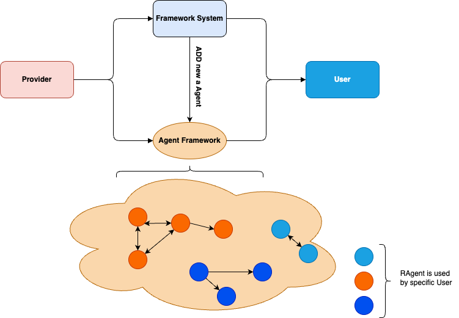

# RAgents Swarm

  

## Overview

RAgents Swarm is a revolutionary distributed AI agent system that enables seamless coordination between specialized agents. Our platform allows AI agents to share resources, collaborate on complex tasks, and achieve unprecedented levels of efficiency through interconnected operations.

## Key Features

- **Distributed Agent Network**: Connect and coordinate multiple specialized AI agents
- **Resource Sharing**: Enable efficient resource allocation and utilization across agents
- **Flexible Integration**: Support for various agent types including social, compute, data, and execution agents
- **Secure Communication**: Built-in protocols for safe and efficient agent interaction
- **Scalable Architecture**: Designed to grow with your needs

## Agent Types

- **Social Agents**: Handle social media interactions and content creation
- **Compute Agents**: Process data and perform complex calculations
- **Data Agents**: Manage and analyze datasets
- **Execution Agents**: Implement real-world actions
- **General Resource Agents**: Support for custom APIs, IoT devices, and more

## Getting Started

[Documentation and setup instructions coming soon]

## System Architecture

The RAgents Swarm system consists of several core components:

- Core System
- Agent Communication Protocol
- Resource Management System
- User Interface Gateway

## Documentation

For detailed information about the system, please refer to:

- [Vision and Overview](./A_Vision_Swarm_of_RAgent.MD)
- [Core System Documentation](./coreSystem.MD)
- [Implementation Plan](./plan.MD)
- [Example Use Cases](./plan_example.MD)
- [System Overview](./overview.MD)

## Contributing

We welcome contributions from the community! If you're interested in improving RAgents Swarm, please:

1. Fork the repository
2. Create your feature branch
3. Commit your changes
4. Push to the branch
5. Create a new Pull Request

## License

[License information coming soon]

## Contact

[Contact information coming soon]

---

  Built with ❤️ for the future of AI collaboration

 