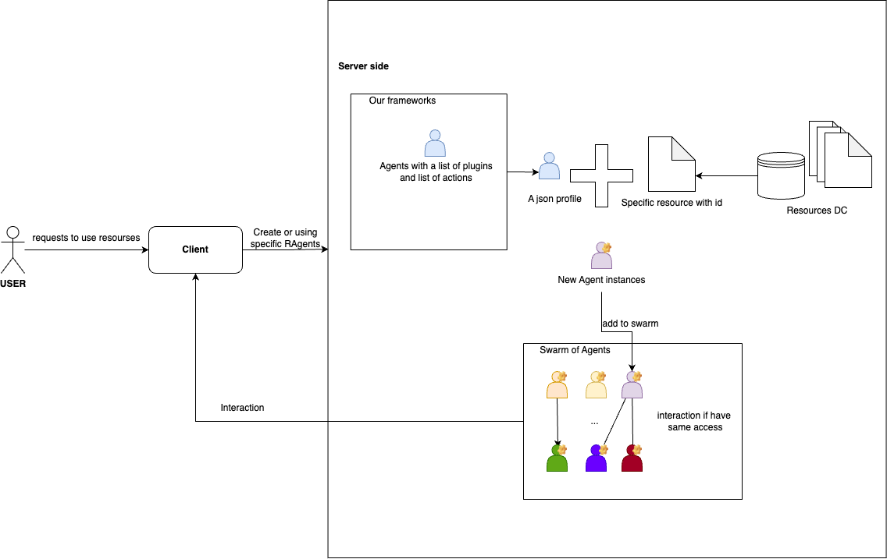

# Core System Architecture

## Table of Contents
- [Overview](#overview)
- [1. RAgent Development Framework](#1-ragent-development-framework)
  - [Built-in RAgents](#built-in-ragents)
  - [Custom RAgent Development](#custom-ragent-development)
  - [Resource Configuration Example](#resource-configuration-example)
  - [Environment Configuration](#environment-configuration)
- [2. Multi-Agent Orchestration SDK](#2-multi-agent-orchestration-sdk)
  - [SDK Features](#sdk-features)
  - [Swarm Orchestration](#swarm-orchestration)
  - [Example SDK Usage](#example-sdk-usage)
- [Contribution Flows](#contribution-flows)
  - [1. RAgent Contribution](#1-ragent-contribution)
  - [2. SDK Contribution](#2-sdk-contribution)
- [Security and Validation](#security-and-validation)
  - [Resource Validation](#resource-validation)
  - [SDK Validation](#sdk-validation)
- [Documentation Links](#documentation-links)

## Overview

### Introduction
We are building a robust ecosystem centered on resource-based Agents (rAgents) with advanced verifiability, complemented by powerful multi-agent orchestration. This enables both the seamless development of new rAgents and the efficient coordination of large-scale agent swarms in production environments.

---

### System Development Focus
We are developing the system in two major parts:
1. Development of rAgents integrated with various resources (RD, RX, RE, RC, or custom). 
   - Providers can clone our framework, add interaction methods, and supply resources via .env configuration. 
   - After thorough review, we merge their contribution.
2. Development of the SDK for creating and orchestrating a Swarm of Agents (multi-agent system). 
   - Users can build custom multi-agent use cases from existing rAgents. 
   - They can also contribute new orchestration methods or example use cases to our SDK.


## 1. RAgent Development Framework

### Built-in RAgents
We provide four core resource agent types:
- **Data Resources (RD)**: For managing datasets, files, and streams
- **Social Resources (RX)**: For social media account interactions
- **Compute Resources (RC)**: For CPU, GPU, and RAM management
- **Execution Resources (RE)**: For Docker and runtime environments

### Custom RAgent Development
Providers can contribute new agent types by:
1. Cloning our framework
2. Implementing resource interactions
3. Configuring environment settings
4. Submitting for review and integration


### Resource Configuration Example
```json
{
    "read",
    "write",
    "execute"
  ]
}
```

### Environment Configuration
```env
# Resource Authentication
RESOURCE_API_KEY=your_api_key
RESOURCE_ENDPOINT=https://api.example.com

# Resource Settings
RESOURCE_MAX_CONNECTIONS=100
RESOURCE_TIMEOUT=30000
```

## 2. Multi-Agent Orchestration SDK

### SDK Features
- Agent interaction protocols
- Resource sharing mechanisms
- Task distribution systems
- Swarm management tools

### Swarm Orchestration
Users can:
1. Create custom multi-agent systems
2. Define interaction patterns
3. Build specialized use cases
4. Contribute new orchestration methods



### Example SDK Usage
```typescript
// Create a swarm of agents
const swarm = new Swarm({
  agents: [socialAgent, computeAgent, dataAgent],
  orchestration: {
    type: 'collaborative',
    strategy: 'round-robin'
  }
});

// Define interaction patterns
swarm.defineInteraction({
  between: ['socialAgent', 'dataAgent'],
  protocol: 'request-response',
  sharing: ['data', 'results']
});
```

## Contribution Flows

### 1. RAgent Contribution
1. Clone framework repository
2. Implement new agent type
3. Configure resource access
4. Submit pull request with:
   - Agent implementation
   - Resource configuration
   - Documentation
   - Tests

### 2. SDK Contribution
1. Fork SDK repository
2. Add new orchestration patterns
3. Create example use cases
4. Submit merge request with:
   - Implementation
   - Documentation
   - Usage examples
   - Performance benchmarks

## Security and Validation

### Resource Validation
- Compliance checking
- Security auditing
- Performance testing
- Integration validation

### SDK Validation
- Pattern verification
- Security assessment
- Scalability testing
- Use case validation

## Documentation Links
- [RAgent Development Guide](plan.MD)
- [SDK Usage Guide](ROME-SDKClient.MD)
- [Resource Integration Guide](rAgent-integration.MD)
