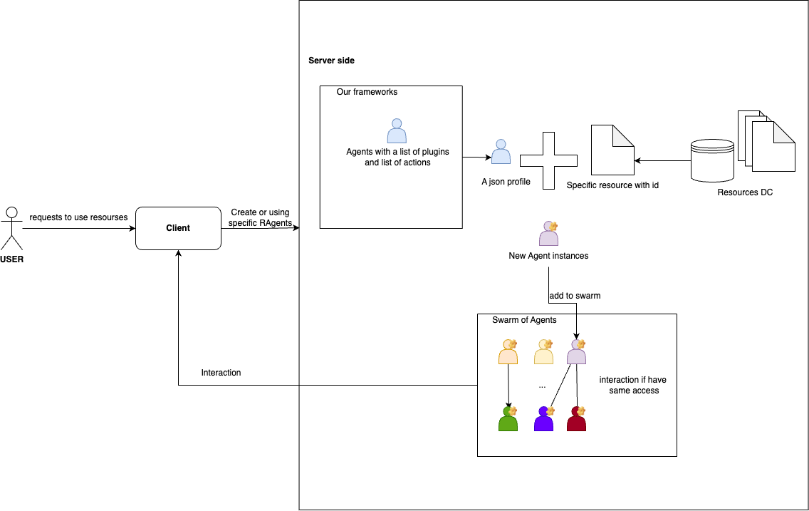

# Core Structure of Our RAgents System

## Introduction
We are building a robust ecosystem centered on resource-based Agents (rAgents) with advanced verifiability, complemented by powerful multi-agent orchestration. This enables both the seamless development of new rAgents and the efficient coordination of large-scale agent swarms in production environments.

---

## System Development Focus
We are developing the system in two major parts:
1. Development of rAgents integrated with various resources (RD, RX, RE, RC, or custom). 
   - Providers can clone our framework, add interaction methods, and supply resources via .env configuration. 
   - After thorough review, we merge their contribution.
2. Development of the SDK for creating and orchestrating a Swarm of Agents (multi-agent system). 
   - Users can build custom multi-agent use cases from existing rAgents. 
   - They can also contribute new orchestration methods or example use cases to our SDK.

---

## Resources Allowable for Provider Contribution and Staking

### **1. Data Resources (RD)**
Providers can securely contribute valuable data and stake it into our system, making it a useful resource for other users.

### **2. Social Resources (RX)**
Providers can stake social media accounts or network resources. These are stored and securely used via blockchain. Users creating pools in our system can allow providers to stake these resources, and permissions are distributed accordingly.

### **3. Compute Resources (RC)**
Providers can stake computing resources such as CPUs, GPUs, and RAM. These are accessible to users needing corresponding resources.

### **4. Execution Resources (RE)**
Providers can stake Docker nodes and runtime environments.

### **5. Custom Resources (RCustom)**
Users can contribute custom resources that may include:

- **Custom APIs**: APIs for specialized services, such as translation, geolocation, or weather data, can become part of the system.
- **IoT Devices**: Smart devices like home automation systems or industrial IoT sensors.
- **Knowledge Bases**: Proprietary datasets or documentation libraries that can be accessed programmatically.
- **Cloud Services**: User-provided cloud-based services, such as private storage or processing environments.

These custom resources are mapped to a dedicated agent type, **Custom Agents (rCustom)**, which ensures seamless integration and efficient utilization of unique user-provided resources. Any contributed resource with a defined access method (e.g., API endpoint, SDK, or other protocols) can be transformed into an agent.

---
### Types of Resources and Corresponding Agents

| **Resource Type**       | **Agent Type**                 | **Description**                                                  |
|--------------------------|-------------------------------|------------------------------------------------------------------|
| **RX**       | Social Agents (rX)  | Social resources (e.g., accounts, interactions)                 |
| **RD**       | Data Agents (rD)    | Data resources (e.g., datasets, files, streams)                 |
| **RC**       | Compute Agents (rC) | Compute resources (e.g., CPU, GPU, RAM)                         |
| **RE**       | Execute Agents (rE) | Execution resources (e.g., Docker nodes, runtime environments)  |
| **RCustom**  | Custom Agents (rCustom) | Customer-defined resources (e.g., custom APIs, IoT devices)      |

Each type of agent specializes in managing and interacting with a corresponding resource type, ensuring seamless integration and efficient operations.

---
### RAgents interact with resources

To enable users to interact with resources managed by our system easily and automatically, we provide a system of RAgents integrated with the resources mentioned above. RAgents are AI-powered language models (LLMs) designed to interact with users and fulfill their requests accurately and flexibly. Users can integrate our RAgents into their systems for custom tasks on resources without extra effort or time.

This figure illustrates the procedure for providers to contribute rAgents to our system. First, they clone our git repository and add new code (inheriting from our template) for their type of agents (upper stream in the figure). Next, they configure the resources used by their new type of agent in the environment or configuration files (lower stream). The contributed rAgent will be reviewed by our experts, and if deemed suitable and functional, it will be merged into our base template. When a user wants to use this type of agent, our system will create an instance of the agent with specific resources and add it to the user's Swarm of Agents.

### A Swarm of Agents (Multi-agent system)

In addition to the system of Agents that providers can expand by adding more types of rAgents, we also offer a client SDK. This SDK allows users to build use cases based on the various types of agents available in our system, including those contributed by providers.

Our SDK provides two important components for orchestrating Swarms:

1. Methods for agents to interact with each other and share resources within the swarm.
2. Sample prototypes of orchestration mechanisms, such as planner decision-making or peer-to-peer decision-making.

Users can utilize our SDK to schedule tasks or build use cases with the rAgents provided by our system and its contributors. Additionally, users can contribute and share their use cases with others by creating merge requests to our SDK repository.

Here is an example of how a user can interact with the client to connect to a Swarm of Agents they own:

We provide two orchestration mechanisms in our system, as shown in the figure below:

Detailed architecture and usage instructions for our SDK can be found in the following documents:
1. To create and contribute rAgents, refer to [how to contribute rAgent](plan.MD).
2. To use the SDK to create a use case for a Swarm of Agents, refer to [how to use our SDK](SwarmSDK.png).
