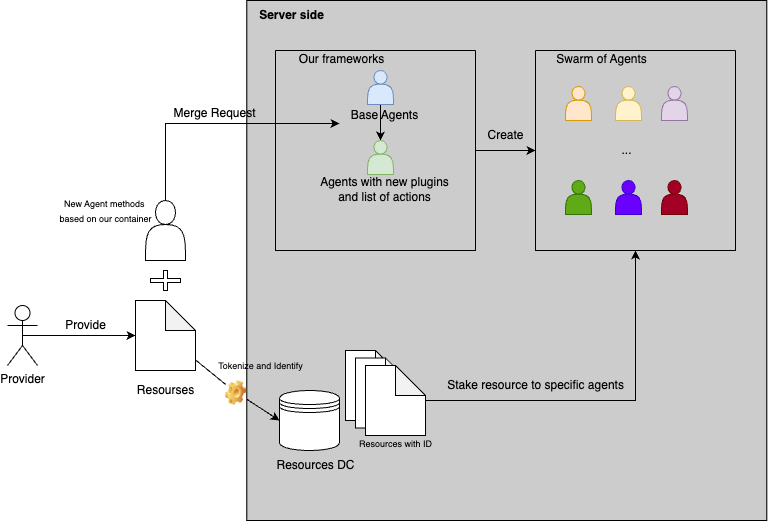

# Core Structure of Our RAgents System

## Introduction
We are developing a framework for resource-associated Agents or rAgents with comprehensive verifiability. Separately, we are creating a system for large-scale swarm orchestration, including mas-rAgent management.

---

## Resources Allowable for Provider Contribution and Staking

### **1. Data Resources (RD)**
Providers can securely contribute valuable data and stake it into our system, making it a useful resource for other users.

### **2. Social Resources (RX)**
Providers can stake social media accounts or network resources. These are stored and securely used via blockchain. Users creating pools in our system can allow providers to stake these resources, and permissions are distributed accordingly.

### **3. Compute Resources (RC)**
Providers can stake computing resources such as CPUs, GPUs, and RAM. These are accessible to users needing corresponding resources.

### **4. Execution Resources (RE)**
Providers can stake Docker nodes and runtime environments.

### **5. Customer Resources (RCustom)**
Users can contribute custom resources that may include:

- **Custom APIs**: APIs for specialized services, such as translation, geolocation, or weather data, can become part of the system.
- **IoT Devices**: Smart devices like home automation systems or industrial IoT sensors.
- **Knowledge Bases**: Proprietary datasets or documentation libraries that can be accessed programmatically.
- **Cloud Services**: User-provided cloud-based services, such as private storage or processing environments.

These custom resources are mapped to a dedicated agent type, **Custom Agents (rCustom)**, which ensures seamless integration and efficient utilization of unique user-provided resources. Any contributed resource with a defined access method (e.g., API endpoint, SDK, or other protocols) can be transformed into an agent.

---

## RAgents interact with resources

To enable users to interact with resources managed by our system easily and automatically, we provide a system of RAgents integrated with the resources mentioned above. RAgents are AI-powered language models (LLMs) designed to interact with users and fulfill their requests accurately and flexibly. Users can integrate our RAgents into their systems for custom tasks on resources without extra effort or time.

## Types of Resources and Corresponding Agents

| **Resource Type**       | **Agent Type**                 | **Description**                                                  |
|--------------------------|-------------------------------|------------------------------------------------------------------|
| **RX**       | Social Agents (rX)  | Social resources (e.g., accounts, interactions)                 |
| **RD**       | Data Agents (rD)    | Data resources (e.g., datasets, files, streams)                 |
| **RC**       | Compute Agents (rC) | Compute resources (e.g., CPU, GPU, RAM)                         |
| **RE**       | Execute Agents (rE) | Execution resources (e.g., Docker nodes, runtime environments)  |
| **RCustom**  | Custom Agents (rCustom) | Customer-defined resources (e.g., custom APIs, IoT devices)      |

Each type of agent specializes in managing and interacting with a corresponding resource type, ensuring seamless integration and efficient operations.
