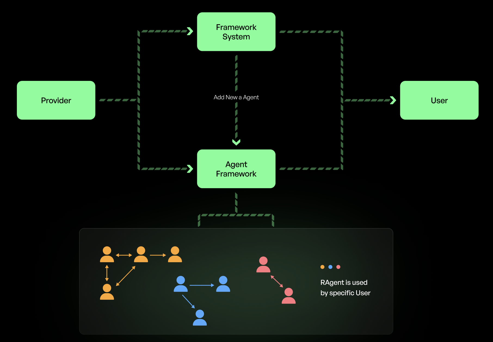

# RAgent Integration Guide

## Table of Contents
- [1. System Overview](#1-system-overview)
- [2. Built-in RAgent Types](#2-built-in-ragent-types)
  - [Social Resources Agent (RX)](#social-resources-agent-rx)
  - [Compute Resources Agent (RC)](#compute-resources-agent-rc)
  - [Data Resources Agent (RD)](#data-resources-agent-rd)
  - [Execution Resources Agent (RE)](#execution-resources-agent-re)
- [3. Contributing Custom RAgents](#3-contributing-custom-ragents)
  - [3.1 Development Process](#31-development-process)
  - [3.2 Resource Configuration](#32-resource-configuration)
  - [3.3 Contribution Process](#33-contribution-process)
- [4. Development Roadmap](#4-development-roadmap)

## 1. System Overview

### 1.1 Introduction
We are building a robust ecosystem centered on resource-based Agents (rAgents) with advanced verifiability, complemented by powerful multi-agent orchestration. This enables both the seamless development of new rAgents and the efficient coordination of large-scale agent swarms in production environments.


---

### 1.2 Key components
In this document, we focus on the structure and component compose the rAgents. In our framework, we have 2 types of rAgents:
  1. Built-in rAgents integrated with various resources (RD, RX, RE, RC) is developed by our expert, it is easy to use and provides automated processing when users stake these resources to our systems.
  2. Custom rAgents with custom resources are provided by users:
      - Providers can clone our framework, develop the new methods, plugins to interaction with their resources, and supply resources via .env configuration. 
      - After thorough review, we merge their contribution.

In this document, we provide the guideline for:
  1. Structure of base agents 
  2. Built-in resource agents (RX, RC, RD, RE) of our system. 
  3. Provider contribute agents to our system.
  4. Resource configuration and management
### 1.3 Ragents - Structure of base agents 
- Our rAgent includes the following core components:
  1. Provider: Acts as the Agent’s brain. We offer a diverse LLM provider system, from open-source to closed-source, which can be integrated via API. The provider makes decisions for tasks, parses commands from users or other Agents, and responds accordingly.
  2. Characters: Serve as the Agent’s base references, defining conversation style and thought patterns. Characters are integrated via a chain-of-thought mechanism.
  3. Basic plugins: E.g., chitchat, answer, and natural language processing.
  4. Client: A feedback channel available through API or web client.
  5. Resource interaction plugins: Require keys to connect to resources, provide methods to perform actions, and handle tasks like posting to social platforms.
  6. Resources settings: Where resource details are specified.
  7. Methods for Swarms and P2P: Covered in the SDK, enabling each Agent to communicate with other Agents.


### 1.4 Benefits and Use Cases

**Benefits**  
- Automate tasks more effectively: rAgents can handle repetitive or time-consuming job flows, enabling faster turnarounds and minimizing human errors.  
- Decentralized, parallel agent management: Multiple rAgents can operate concurrently across different resources, supporting higher scalability and reducing single points of failure.  
- Monetize unused resources: Users can lease idle computing power or social media accounts to the network, opening new revenue streams while optimizing resource utilization.  
- Flexible customization: With a modular plugin system, providers can easily tailor rAgents for specific needs, integrating custom APIs and specialized features without disrupting other components.  
- Streamlined development environment: The common framework unifies configuration, testing, and deployment, helping both small teams and large enterprises build reliable agent solutions quickly.

**Use Cases**  
- Automated multi-account content operations: A user with several social networking accounts can link them to rAgents that create consistent, style-matched posts. This allows rapid marketing campaigns or updates without manual supervision.  
- Agent collaboration in market analysis: One rAgent crawls data from multiple sources while another interprets the results, then a posting-focused rAgent publishes relevant insights. The system orchestrates these tasks seamlessly.  
- Cost-effective resource sharing: Organizations or individuals with occasional surplus in CPU, GPU, or storage can lease them to other users, fostering a peer-to-peer ecosystem where providers earn and consumers save.  
- Coordinated research and development tasks: Data-focused rAgents can pull large datasets, parse them, and feed insights to compute rAgents, which run simulations or machine learning models in parallel.  
- Dynamic scaling for deployment: Execution rAgents automatically spin up new containers or VMs in response to heavy traffic, ensuring stable performance for applications that experience sudden spikes in demand.
- ...

## 2. Built-in RAgent Types

### Social Resources Agent (RX)

#### **Purpose:**
Manage social media interactions, content posting, sentiment analysis, and engagement monitoring across platforms like Twitter, Discord, and Facebook.

#### **JSON Definition:**
```json
{
  "type": "RX",
  "platforms": {
    "twitter": {
      "apiKey": "string",
      "accessToken": "string"
    },
    "discord": {
      "botToken": "string",
      "permissions": ["string"]
    }
  },
  "api_endpoints": {
    "post": "/api/v1/social/post",
    "analyze": "/api/v1/social/analyze",
    "monitor": "/api/v1/social/monitor"
  },
  "capabilities": ["post", "analyze", "monitor"]
}
```

#### **Actions:**
```python
def post_content_action(runtime, message, state):
    platform = message['platform']
    content = message['content']
    return runtime.api_call(
        method="POST",
        url=runtime.endpoints['post'],
        data={'platform': platform, 'content': content}
    )
```

### Compute Resources Agent (RC)

#### **Purpose:**
Manage and optimize computational resources including CPU, GPU, and RAM allocation.

### Compute Resources Agent (RC)

#### **Purpose:**
Manage and optimize computational resources including CPU, GPU, and RAM allocation. Monitor hardware performance, execute commands, and handle resource distribution across the system.

#### **JSON Definition:**
```json
{
  "type": "RC",
  "hardware": {
    "cpu": {
      "cores": "int",
      "architecture": "string",
      "frequency": "float"
    },
    "gpu": {
      "model": "string",
      "vram": "int",
      "cuda_cores": "int"
    },
    "ram": {
      "total": "int",
      "type": "string",
      "frequency": "int"
    }
  },
  "api_endpoints": {
    "allocate": "/api/v1/compute/allocate",
    "monitor": "/api/v1/compute/monitor",
    "execute": "/api/v1/compute/execute",
    "release": "/api/v1/compute/release"
  },
  "capabilities": ["allocation", "monitoring", "execution"]
}
```

#### **Actions:**
```typescript
const allocateResourcesAction: Action = {
  name: "allocateResources",
  description: "Allocate computational resources for a task",
  examples: [{ 
    cpu_cores: 4, 
    gpu_memory: "2GB", 
    ram: "8GB" 
  }],
  handler: async (runtime, message, state) => {
    const { requirements } = message;
    return await runtime.apiCall({
      method: "POST",
      url: runtime.endpoints.allocate,
      data: requirements
    });
  }
};

const monitorResourcesAction: Action = {
  name: "monitorResources",
  description: "Monitor resource usage and performance metrics",
  examples: [{ 
    metrics: ["cpu_usage", "gpu_temp", "ram_usage"],
    interval: "1s"
  }],
  handler: async (runtime, message, state) => {
    const { metrics, interval } = message;
    return await runtime.apiCall({
      method: "GET",
      url: runtime.endpoints.monitor,
      params: { metrics, interval }
    });
  }
};
```

### Data Resources Agent (RD)

#### **Purpose:**
Handle data operations across various sources including databases, file systems, and streaming platforms. Perform data transformations, queries, and analytics tasks.

#### **JSON Definition:**
```json
{
  "type": "RD",
  "sources": {
    "databases": {
      "type": ["mysql", "postgresql", "mongodb"],
      "connection": {
        "host": "string",
        "port": "int",
        "credentials": "object"
      }
    },
    "storage": {
      "type": ["s3", "gcs", "local"],
      "config": {
        "bucket": "string",
        "region": "string"
      }
    },
    "streaming": {
      "type": ["kafka", "rabbitmq"],
      "endpoints": ["string"]
    }
  },
  "api_endpoints": {
    "query": "/api/v1/data/query",
    "transform": "/api/v1/data/transform",
    "stream": "/api/v1/data/stream",
    "analyze": "/api/v1/data/analyze"
  },
  "capabilities": ["query", "transform", "stream", "analyze"]
}
```

#### **Actions:**
```typescript
const queryDataAction: Action = {
  name: "queryData",
  description: "Execute queries across data sources",
  examples: [{ 
    source: "mysql",
    query: "SELECT * FROM users WHERE age > 21"
  }],
  handler: async (runtime, message, state) => {
    const { source, query } = message;
    return await runtime.apiCall({
      method: "POST",
      url: runtime.endpoints.query,
      data: { source, query }
    });
  }
};

const transformDataAction: Action = {
  name: "transformData",
  description: "Transform data between formats or schemas",
  examples: [{ 
    source_format: "csv",
    target_format: "json",
    schema: { /* transformation rules */ }
  }],
  handler: async (runtime, message, state) => {
    const { format, schema } = message;
    return await runtime.apiCall({
      method: "POST",
      url: runtime.endpoints.transform,
      data: { format, schema }
    });
  }
};
```

### Execution Resources Agent (RE)

#### **Purpose:**
Manage containerized environments and runtime execution contexts. Handle deployment, scaling, and monitoring of containers and virtual machines.

#### **JSON Definition:**
```json
{
  "type": "RE",
  "environments": {
    "containers": {
      "engine": "docker",
      "orchestration": "kubernetes",
      "registry": {
        "url": "string",
        "credentials": "object"
      }
    },
    "runtimes": {
      "languages": ["python", "node", "java"],
      "versions": ["string"]
    }
  },
  "api_endpoints": {
    "deploy": "/api/v1/exec/deploy",
    "scale": "/api/v1/exec/scale",
    "logs": "/api/v1/exec/logs",
    "status": "/api/v1/exec/status"
  },
  "capabilities": ["deployment", "scaling", "monitoring"]
}
```

#### **Actions:**
```typescript
const deployContainerAction: Action = {
  name: "deployContainer",
  description: "Deploy a containerized application",
  examples: [{ 
    image: "nginx:latest",
    replicas: 3,
    ports: ["80:80"]
  }],
  handler: async (runtime, message, state) => {
    const { image, config } = message;
    return await runtime.apiCall({
      method: "POST",
      url: runtime.endpoints.deploy,
      data: { image, config }
    });
  }
};

const fetchLogsAction: Action = {
  name: "fetchLogs",
  description: "Retrieve logs from running containers",
  examples: [{ 
    container_id: "abc123",
    tail: 100,
    since: "5m"
  }],
  handler: async (runtime, message, state) => {
    const { container_id, options } = message;
    return await runtime.apiCall({
      method: "GET",
      url: runtime.endpoints.logs,
      params: { container_id, ...options }
    });
  }
};
```

## 3. Contributing Custom RAgents

### 3.1 Development Process

1. Clone the framework:
```bash
git clone https://github.com/rome/ragents
cd ragents
npm install
```

2. Create agent profile:
```json
{
  "name": "CustomAgent",
  "plugins": ["customResourcePlugin"],
  "settings": {
    "auth": {
      "type": "bearer"
    }
  }
}
```

3. Develop plugin:
```typescript
export const customResourcePlugin: Plugin = {
  name: "customResource",
  actions: [customAction],
  providers: [customProvider],
  description: "Custom resource integration"
};
```

### 3.2 Resource Configuration

1. Configure environment:
```env
# Resource Authentication
RESOURCE_API_KEY=your_api_key
RESOURCE_SECRET_KEY=your_secret_key
RESOURCE_ENDPOINT=https://api.yourresource.com

# Resource Settings
RESOURCE_MAX_CONNECTIONS=100
RESOURCE_TIMEOUT=30000
```

2. Define resource:
```json
{
  "resourceType": "custom",
  "endpoints": {
    "primary": "${RESOURCE_ENDPOINT}"
  },
  "limits": {
    "maxConnections": "${RESOURCE_MAX_CONNECTIONS}",
    "timeout": "${RESOURCE_TIMEOUT}"
  }
}
```

